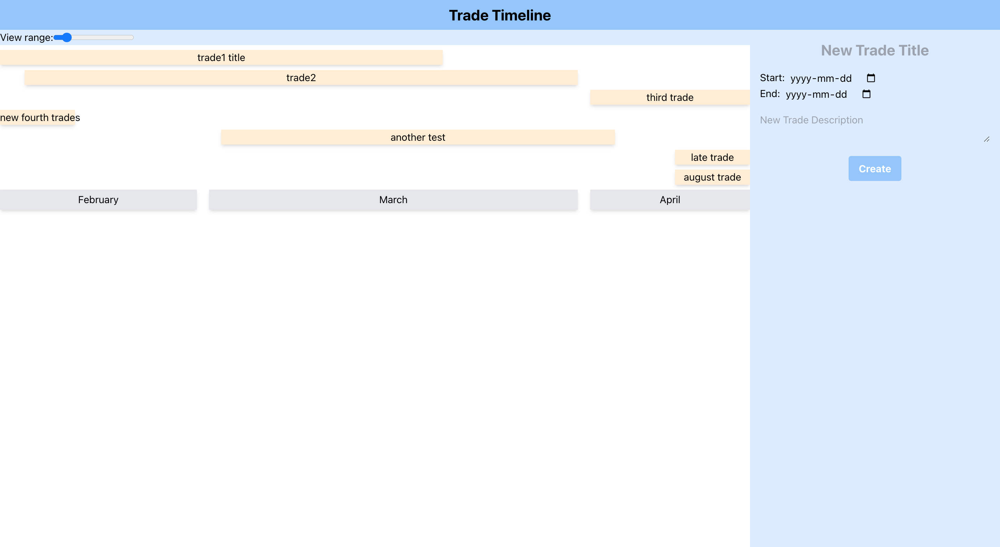

# Trade Timeline

Trade Timeline is a personal project that helps investors keep track of their trades on a timeline that can be zoomed in and out. This Ruby on Rails app uses a React and Redux frontend to provide a user-friendly interface that allows users to add and view trades with ease.

## Features

- Timeline zooming: The timeline can be zoomed in and out, with a maximum zoom of 1 year and a minimum zoom of 7 days. This allows users to see all their trades for the next year, or just the trades that are happening soon.
- Trade creation: Users can add trades to the timeline, providing a title, description, start and end dates. This makes it easy to keep track of all trades that are ongoing, upcoming, or have been completed.
- Thesis-driven trading: The app is designed to help investors who follow a thesis-driven trading approach. By being aware of all their ongoing trades, investors can fight emotions and accumulate during pre-planned times when things are risky.

### Add new trade

### Selected view

### Long view

## Technologies

Trade Timeline is built with the following technologies:

- Ruby on Rails: A web application framework used to build the backend of the app.
- React: A JavaScript library used to build the frontend of the app.
- Redux: A state management library used with React to manage the state of the application.

## Getting started

To run Trade Timeline locally, you will need to have Ruby, Rails, and Node.js installed on your machine. Follow these steps to get started:

1. Clone this repository: `git clone https://github.com/sunnymnie/trade-timeline.git`
2. Install dependencies: `bundle install` and `yarn install`
3. Set up the database: `rails db:migrate`
4. Start the Rails server: `rails s`
5. Start the frontend server with `cd frontend` then `npm run start`

Trade Timeline should now be running on `http://localhost:3001/`.

## Contributing

If you would like to contribute to Trade Timeline, please open an issue or submit a pull request. All contributions are welcome!

## License

Trade Timeline is licensed under the [MIT License](https://opensource.org/licenses/MIT).
